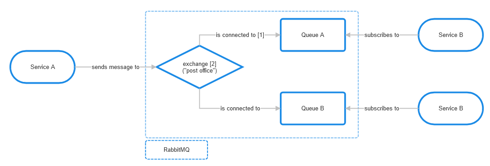

# RabbitMQ
## Theory
Source: https://kisztof.medium.com/rabbitmq-an-introduction-to-message-queuing-protocols-and-policies-cb6073c7a3d6
### What is RabbitMQ?
RabbitMQ is a messaging / streaming software also known as message broker or queue manager. It is a software which defines queues, to which other services connect in order to transfer message(s). 
### What is message queueing?
Message queueing enables asynchronous communication between different systems in order to increase system raliability, scalability and flexibility.
### What is a queue (in generic terms)?
In generic terms it is a sequential data structure with two primary operations:
- An item can be queued at the tail and
- dequeued from the head
### What is a queue (in RabbitMQ)?
A queue in RabbitMQ is an ordered collection of messages / message buffer.
Queues can be durable, meaning the can survive a node restart of the broker. OR transient, meaning they are deleted when the node restarts.
Queues are bound to exchanges.
### How are the messages processed?
Messages are enqueued and dequeued in an FIFO manner.
### What is an exchange?
An exchange is repsonible for receiving messages from the producer and routing them to queues based on rules called bindings. There are four types of exchanges:
- fanout
- direct
- topic
- headers
Whereby RabbitMQ implements another one:
- nameless
### What is a binding?
A binding is a relationship between an exchange and a queue and defines how messages should be routed.
### Which protocols does RabbitMQ support?
RabbitMQ supports severals messaging protocols directly or through the use of plugins:
- AMQP (Advanced Message Queuing Protocol) 0-9-1 (https://www.rabbitmq.com/tutorials/amqp-concepts#overview)
- STOMP
- MQTT
- AMQP 1.0
### Basic workflow


## Setup environment with docker
You can either run just the RabbitMQ server or run the RabbitMQ server togethere with an RabbitMQ management web ui for monitoring and observability.
### RabbitMQ server
```docker
docker run -d --name rabbit-mq-server \
--hostname rabbit-mq \
-e RABBITMQ_DEFAULT_USER=user \
-e RABBITMQ_DEFAULT_PASS=password \
-p 8090:5672 \
rabbitmq
```

### RabbitMQ management
```docker
docker run -d --name rabbit-mq-management \
--hostname rabbit-mq \
-e RABBITMQ_DEFAULT_USER=user \
-e RABBITMQ_DEFAULT_PASS=password \
-p 8091:15672 \
rabbitmq:management
```

## Rabbitmqctl
``rabbitmqctl`` is the main command line tool for managing a RabbitMQ server node

### List RabbitMQ queues and number of messages

``docker container exec -it rabbit-mq-management rabbitmqctl list_queues``

### List unacknowledged messages
``docker exec -it rabbit-mq-management rabbitmqctl list_queues name messages_ready messages_unacknowledged``

## Hands on
Connecting to the RabbitMQ server keeps the same for the different tutorials. Look at [connect.py](./connect.py).
### 01 Working Queue - durable queue and messages
[01_work_queue_producer.py](./01_work_queue_producer.py)

[01_work_queue_consumer.py](./01_work_queue_consumer.py)

### 02 Publish / Subscribe - Multiple temporary queues - Fanout exchange
[02_multiple_consumers_producer.py](./02_multiple_consumers_producer.py)

[02_multiple_consumers_consumer.py](./02_multiple_consumers_consumer.py)

### 03 Routing - Direct exchange
[03_routing_producer.py](./03_routing_producer.py)

[03_routing_consumer.py](./03_routing_consumer.py)
